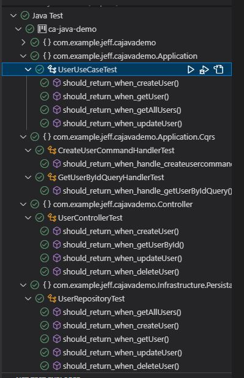

# ca-java-demo

## Tech Stack

- [x] Java
- [x] Spring Boot
- [x] Maven
- [x] lombok
- [x] pipelinR
- [x] DDD
- [x] Spring Data
- [x] Logging,Log4j
- [x] Junit,Mokito
- [] OpenApi[TODO]
- [] Authentication[TODO]
- [] Resilience4j[TODO]

# JDK 18

# Maven

```java
## build
$ mvn package

## run
$ mvn spring-boot:run
```

## Api Test


## Unit Test



# Read Me First

The following was discovered as part of building this project:

- The original package name 'com.example.jeff.ca-java-demo' is invalid and this project uses 'com.example.jeff.cajavademo' instead.

# Getting Started

### Reference Documentation

For further reference, please consider the following sections:

- [Official Apache Maven documentation](https://maven.apache.org/guides/index.html)
- [Spring Boot Maven Plugin Reference Guide](https://docs.spring.io/spring-boot/docs/3.0.2/maven-plugin/reference/html/)
- [Create an OCI image](https://docs.spring.io/spring-boot/docs/3.0.2/maven-plugin/reference/html/#build-image)
- [Spring Web](https://docs.spring.io/spring-boot/docs/3.0.2/reference/htmlsingle/#web)

### Guides

The following guides illustrate how to use some features concretely:

- [Building a RESTful Web Service](https://spring.io/guides/gs/rest-service/)
- [Serving Web Content with Spring MVC](https://spring.io/guides/gs/serving-web-content/)
- [Building REST services with Spring](https://spring.io/guides/tutorials/rest/)
